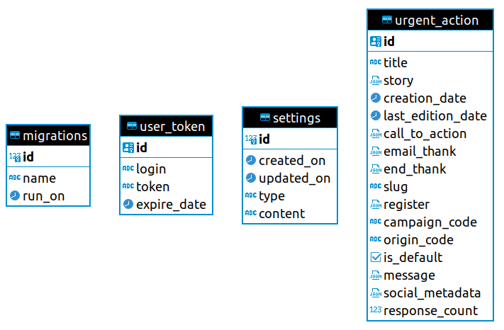

Incaya a été mandaté par Amnesty en mars 2023 pour reprendre en main la base de code du projet Actions Urgentes afin d'en assurer sa maintenance. Ce document est une trace des notes et des remarques notables émises lors de la découverte de cette base de code legacy.

## Architecture globale du projet

Ce qui ressort de manière forte de l'analyse de l'architecture globale du projet, c'est l'inadéquation entre la simplicité des fonctionnalités du projet et les solutions techniques choisies pour les mettre en oeuvre.

En effet, le projet consiste à gérer un objet métier finalement assez simple, les actions urgentes, puisque constituées de contenus éditoriaux (du texte parfois formaté en HTML et des images) et d'un identifiant technique les reliant au Salesforce Amnesty. 

Il s'agit ensuite d'afficher sur le site public une seule de ces actions, celle déclarée comme action par défaut en fonction d'un flag activé manuellement, et d'afficher un lien `mailto` à l'utilisateur.

Le modèle de la base de données confirme cette simplicité :

**Face à cela, les outils et l'organisation du projet mis en place sont très performants, mais sont plutôt prévus pour répondre à des projets d'envergure avec beaucoup plus de complexité métiers** :
- une API en GraphQL dont le point fort est d'éviter les problèmes de retour de données insuffisants (under-fetching) ou surnuméraires (over-fetching). Dans le cas d'A.U. ce problème ne se pose pas vu la simplicité des données.
- des composants visuels isolés dans un module à la manière d'un design system. La complexité induite par cela (comme l'utilisation d'un monorepos ou la mise en place d'un storybook) nous semble inadaptée à la gestion de 3 composants React uniquement utilisés sur le projet A.U. et partagés entre l'administration et le site publique pour faire une simple prévisualisation.
- une base de données PostgreSQL sollicitée pour gérer 4 tables contenant pour les tables métiers une trentaine d'enregistrements.

Cette stack technique répond au besoin actuel et permettrait sans doute de faire énormément évoluer le projet en complexité métier. Si ce besoin devait être exprimé. 

Mais en l'état, il induit selon nous plus de désavantages que d'atouts :

- **Des difficultés à entrer sur le projet**. Il nous a fallu beaucoup (trop) de temps pour comprendre la simplicité du besoin derrière la complexité technique. Cela est d'autant plus vrai que le projet n'était pas documenté (aucune information claire concernant Salesforce par exemple). Ceci est en partie résolu puisque nous l'avons documenté au fil de la prise en main. Mais le projet requiert cependant toujours une bonne expérience technique de la part du développeur, ou alors un temps de montée en compétences.
- **Une augmentation du temps d'intervention** : plus de complexité équivaut immanquablement à plus de code, et donc à plus de temps pour intervenir sur la bonne partie de code. Cette remarque est cependant à modérer par le fait que le code legacy est de qualité et bien découpé.
- **Un cout de maintenance plus élevé. C'est sans doute le principal problème du projet**. Prenons l'exemple du GraphQL. Si ce choix d'architecture d'API nous semble être comparable au choix d'une moissonneuse pour tondre son jardin, il répond au besoin. Mais choisir GraphQL, c'est aussi ajouter **une quinzaine de dépendances au projet**. Mais plus un projet va posséder de dépendances, plus il va demander une maintenance régulière : ces dépendances vont par exemple présenter des failles de sécurité, ou alors évoluer très rapidement (ce qui est particulièrement vrai dans le monde du JavaScript) en imposant ce qu'on appelle des breaking changes (c'est-à-dire des nouvelles versions imposant de reprendre le code pour fonctionner). La maintenance d'Action Urgente n'ayant visiblement pas été faite régulièrement, cela confère **une certaine fragilité au projet**. Aujourd'hui, on ne peut pas opérer de mise à jour de toutes les dépendances sans tout casser. Et certaines dépendances ne sont même plus maintenues ...
- **Une évolution plus compliquée**, en grande partie dûe aux problèmes de dépendances précédemment vus.
- **Un déploiement plus complexe et plus lent**, puisqu'il faut déployer deux projets (le backend avec son interface d'administration et l'application publique), chacun réclamant des processus de construction spécifique.
- **Un coût d'hébergement plus élevé** puisque le projet est actuellement composé de deux applicatif et d'une base de données.
- **Une écoconception relative** : plus le projet va être complexe et possédera de dépendances, plus le coût énergétique global sera élevé : téléchargements plus conséquents, espace disque plus important sur les environnements d'intégration continue, ressources processeurs nécessaires pour générer les builds finaux...

## Première tentative de simplification

Rapidement confrontés à la complexité de l'architecture, nous avons voulu expérimenter lors de la prise en main du code une migration vers [Next.js](https://nextjs.org/). **L'objectif principal était de ne plus avoir à gérer qu'une seule et même application.**

Si ce choix de Next.js est contestable (Next.js étant lui-même une grosse dépendance laissant entrevoir [dès maintenant des breaking changes](https://beta.nextjs.org/docs/upgrade-guide#migrating-from-pages-to-app)), cela nous a tout de même permis de rentrer dans le coeur de projet, et de confirmer ou d'infirmer certaines hypothèses.

Tout d'abord, **le passage de GraphQL à une API Rest ne serait pas problématique**. Les règles métier sont simples et bien isolées dans le code. L'avantage de ce changement d'API est de supprimer un grand nombre de dépendances, la mise en place d'une API étant possible *nativement* avec Express.js.

Ensuite, **l'adaptation du code de react-admin ne pose pas non plus de problème** majeur, puisqu'il a suffi de changer son *dataProvider* pour migrer de l'API GraphQL à l'API REST. De plus, l'utilisation d'une application react-admin au sein d'une application Next.js [ne pose pas de problème](https://marmelab.com/react-admin/NextJs.html).

**Le problème est venu de l'application publique construite comme une single page app (SPA).** Le travail permettant de migrer de GraphQL à REST est plus délicat que pour l'administration, mais le principal frein a été de rendre compatible cette SPA s'appuyant sur le composant *react-router* avec l'approche [server side rendering](https://www.theodo.fr/digital-et-strategie/server-side-rendering-seo-performance) (SSR) de Next.js reposant sur sa propre brique de routing.

**Nous n'avons donc pas continué sur cette voie, le temps nous manquant pour faire une migration sans risque de régressions.**

## Interventions à prévoir

Si les notes précédentes pointent les problèmes, **la base de code actuelle n'en reste pas moins parfaitement fonctionnelle**. Si elle nous semble améliorable, le coût de ces améliorations techniques serait selon nous injustifié tant que le périmètre fonctionnel n'évolue pas de façon majeure. **Et surtout ce coût ne compenserait pas le surcoût de maintenance précédemment évoqué.**

Mais nous avons tout de même relevé quelques points qu'il nous semblerait important d'adresser dans le cadre de la maintenance.

### Compteur de taille de lien mailto

[Carte Taiga #2](https://tree.taiga.io/project/thomasmaziere-actions-urgentes-amnesty/us/2)

### Clarification du formulaire d'administration des actions

[Carte Taiga #3](https://tree.taiga.io/project/thomasmaziere-actions-urgentes-amnesty/us/3)

### Optimisation du formulaire d'administration des actions

[Carte Taiga #4](https://tree.taiga.io/project/thomasmaziere-actions-urgentes-amnesty/us/4)

### Remise en place des teste e2e

[Carte Taiga #5](https://tree.taiga.io/project/thomasmaziere-actions-urgentes-amnesty/us/5)

### Suppression du code mort

[Carte Taiga #6](https://tree.taiga.io/project/thomasmaziere-actions-urgentes-amnesty/us/6)

### Utilisation des identifiants Salesforce plutôt que des codes

[Carte Taiga #7](https://tree.taiga.io/project/thomasmaziere-actions-urgentes-amnesty/us/7)
