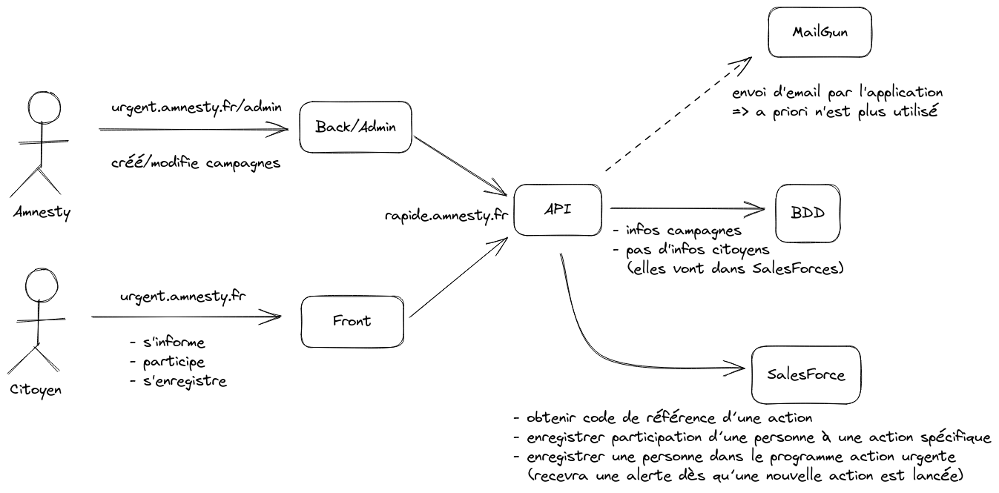

## Les fonctionnalités

L'objectif d'Actions Urgentes (A.U.) est de permettre à Amnesty de solliciter rapidement et simplement - par SMS - des personnes qui se seront inscrites au [programme](https://www.amnesty.fr/inscription/actions-urgentes-sms) afin qu'elles puissent envoyer des emails ciblés, mais individualisés pour défendre une personne ou un groupe de personnes. 

> Remarque : la partie envoi de SMS n'est pas assurée par l'application.

Pour cela, l'application est séparée en deux grandes parties :
- **une administration** constituée d'une interface graghique de gestion et d'une API, permettant de lancer une action à laquelle le public pourra participer
- **un site publique** permettant aux visiteurs de prendre connaissance de l'alerte et d'obtenir un mail prérédigé à envoyer depuis leur propre système de messagerie.

### L'interface d'administration

Cette interface permet de créer et d'éditer une action, composée principalement :

- **De renseignements techniques** permettant entre autres de lier l'action au **CRM (Salesforce) d'Amnesty**. En effet, les participations ne sont pas persistées dans l'applicatif, mais sur le CRM. Et c'est aussi depuis le CRM que sont envoyés les SMS.
- **Une partie narrative** décrivant l'alerte (la personne en danger).
- **Du contenu de l'email prérédigé** et ses destinataires.
- De contenus destinés aux **partages sur les réseaux sociaux**.

### L'interface publique

L'interface publique permet d'afficher le workflow de l'action en cours :

1. Présentation de l'action en un ou plusieurs slides.
2. Une description de ce que peut faire l'utilisateur (en l'occurrence, envoyer un mail).
3. Présentation du mail prérempli, avec **un lien "Envoyer le mail" qui est en fait un lien de type `mailto`** ouvrant le gestionnaire de messagerie par défaut de l'utilisateur avec le mail prérempli.
4. Si l'utilisateur n'est pas inscrit au programme A.U., on lui propose de le faire (opt-in).
5. Un lien de partage vers les réseaux sociaux.

## L'architecture

## La stack techique

Tout le projet est écrit en [**TypeScript**](https://www.typescriptlang.org/docs/).

1. Le backend repose sur le framework [**Express.js**](https://expressjs.com/fr/4x/api.html). Il sert une API en [**GraphQL**](https://graphql.org/graphql-js/express-graphql/). Les contenus sont persisté sur une base de données [**PostgreSQL**](https://node-postgres.com/) par l'intermédiaire de [**Knex.js**](https://knexjs.org/guide/). Les migrations de la base sont gérées par [**db-migrate**](https://db-migrate.readthedocs.io/en/latest/).
2. L'interface d'administration du backend repose sur [**react-admin**](https://marmelab.com/react-admin/documentation.html) et le connecteur GraphQL [**apollo**](https://www.apollographql.com/docs/react/).
3. L'application publique est une application [**Create React App**](https://create-react-app.dev/) et utilise aussi le client GraphQL [**apollo**](https://www.apollographql.com/docs/react/). Cette application est une Single Page App (**SPA**).
4. Une partie des composants d'affichage sont partagés par l'administration et le site. Ils ont été isolés au sein d'un module spécifique `amnesty-component`. Afin de ne pas avoir à publier ce composant sur une registry, l'ensemble du projet est géré comme un **mono-repo** avec [**les workspaces Yarn**](https://classic.yarnpkg.com/blog/2017/08/02/introducing-workspaces/).

L'ensemble du projet est déployé sur [**Clever Cloud**](https://www.clever-cloud.com/fr/) par l'intermédiaire des outils de déploiement de [**Gitlab**](https://gitlab.com/amnesty-france/urgent/-/environments).
