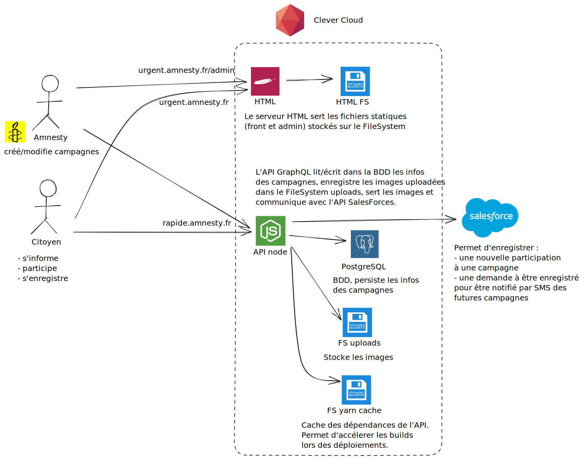

Le projet Action Urgente est déployé sur Clever Cloud. Deux environnement sont disponibles :

Production :
 * front : https://urgent.amnesty.fr
 * admin : https://urgent.amnesty.fr/admin

Release / pré-production / staging :
 * front : https://release.urgent.amnesty.fr
 * admin : https://release.urgent.amnesty.fr/admin

Chaque déploiement (release et prod) est composé des  :
 * d'un serveur Apache servant les assets statiques (front et admin)
 * d'un FileSystem stockant ces assets
 * d'une base de données PostgreSQL
 * d'une API node
 * d'un FileSystem stockant les images uploadées
 * d'un FileSystem pour le cache yarn pour accélérer les builds lors des déploiements

## Déployer le code

Le code est hébergé sur GitLab ([lien](https://gitlab.com/amnesty-france/urgent)) et une pipeline [GitLab CI](https://docs.gitlab.com/ee/ci/) est configurée pour permettre le déploiement sur les environnements de release et de production selon les déclencheurs suivants :
 * toute modification de la branche develop entraîne un déploiement sur l'environnement release
 * tout tag git pushé dans le repo entraîne un déploiement en production

La CI est composée des trois étapes : test, build et deploy.
 * test : tester certains étapes du build
 * build : fabriquer les assets statiques du front et de l'admin
 * deploy :
   * pour l'API, clever link puis clever deploy : le runner GitLab push le code sur Clever qui se charge du build et déploiement
   * pour les assets statiques : rclone envoie en FTP les assets précédemment buidés sur le FileSystem du serveur Apache.
